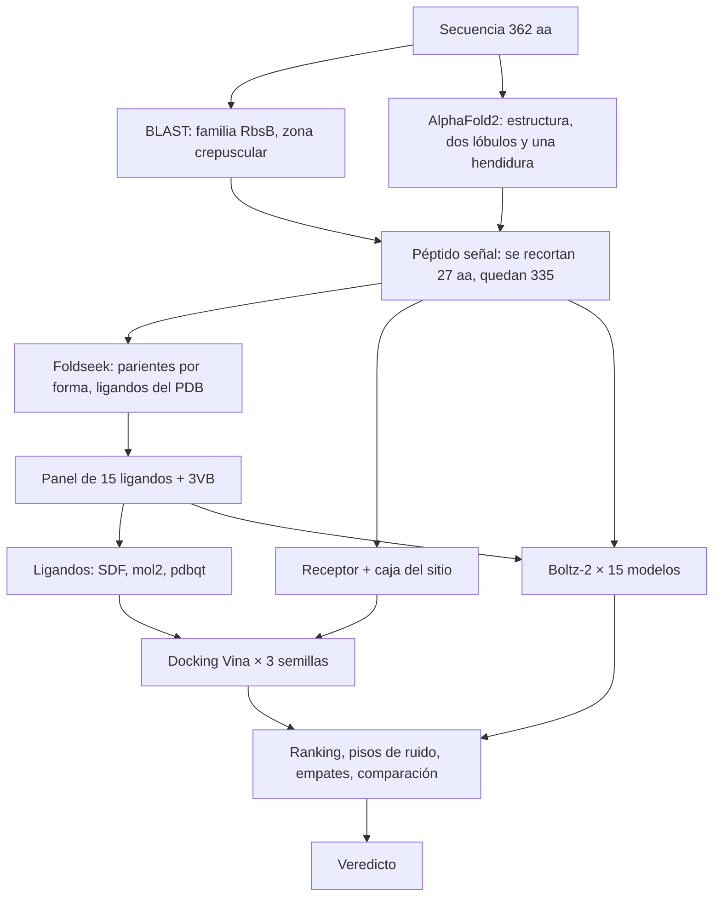

# Guía paso a paso · De una secuencia sin etiqueta a un ranking de ligandos

*Curso Evolución y Diseño de Proteínas 2027-1 · proteína TeuB*

Esta guía reconstruye **todo lo que se hizo** en la práctica, en el orden en que se hizo, para que puedas repetirlo tú solo y, sobre todo, **entender por qué** se hizo cada cosa. En cada etapa vas a encontrar cuatro partes:

- **La idea:** qué pregunta responde la etapa y la teoría mínima necesaria.
- **Cómo se hace:** los comandos exactos o los clics.
- **Qué mirar en el resultado:** cómo leer lo que sale.
- **Lo que obtuvimos:** los números reales de TeuB, para que compares.

Los errores que cometimos en el camino también están, marcados con ⚠️, porque se aprende tanto de ellos como de lo que salió bien.

> **Convención:** todos los comandos se ejecutan desde la raíz del proyecto:
> ```bash
> cd ~/cursos/proteinas/tareasugar
> ```
> Donde dice `python`, usa el Python de miniforge (`~/miniforge3/bin/python`) o activa antes el entorno con `conda activate base`. El `python3` del sistema no tiene numpy ni Biopython.

---

## Índice

0. [El problema: qué se pregunta y por qué es difícil](#0--el-problema)
1. [Preparar el entorno](#1--preparar-el-entorno)
2. [Etapa 1 · La secuencia](#etapa-1--la-secuencia)
3. [Etapa 2 · BLAST: ¿a qué familia pertenece?](#etapa-2--blast)
4. [Etapa 3 · AlphaFold2: predecir la estructura](#etapa-3--alphafold2)
5. [Etapa 4 · El péptido señal: dónde empieza la proteína de verdad](#etapa-4--el-péptido-señal)
6. [Etapa 5 · Foldseek: buscar parientes por forma y construir el panel](#etapa-5--foldseek)
7. [Etapa 6 · Conseguir y verificar los ligandos](#etapa-6--los-ligandos)
8. [Etapa 7 · Acoplamiento molecular con AutoDock Vina](#etapa-7--docking-con-vina)
9. [Etapa 8 · Co-plegamiento con Boltz-2](#etapa-8--co-plegamiento-con-boltz-2)
10. [Etapa 9 · El ranking: pisos de ruido, empates y comparación](#etapa-9--el-ranking)
11. [Etapa 10 · La predicción y el entregable](#etapa-10--predicción-y-entregable)
12. [Apéndices: errores, glosario, mapa de archivos](#apéndices)

---

## 0 · El problema

### La situación

Te dan una **secuencia de 362 aminoácidos** y nada más: ni nombre, ni función, ni estructura. Se llama TeuB (número de acceso AGB73230.1) y viene de una bacteria del grupo de *Rhizobium*, bacterias del suelo que viven asociadas a las raíces de las plantas.

La pregunta de la práctica es:

> **¿Qué molécula pequeña (qué azúcar) une esta proteína?**

Nadie conoce la respuesta experimental. Por eso la práctica **no califica que aciertes**, sino que **razones con evidencia y midas cuánto confiar en tus propios números**.

### Qué se persigue

Al final hay que entregar:

1. Una **lista de ligandos ordenada por afinidad aparente**, obtenida por **dos métodos independientes**:
   - **Acoplamiento molecular (docking) con AutoDock Vina:** coloca una molécula rígida o semirrígida dentro de una proteína rígida y le asigna un puntaje físico-empírico en kcal/mol.
   - **Co-plegamiento con Boltz-2:** una red neuronal, parecida a AlphaFold 3, predice la proteína y el ligando juntos y da una confianza (ipTM).
2. El **piso de ruido** de cada método: cuánto varía el número si repites la corrida. Sin esto no puedes saber si una diferencia entre dos ligandos es real o solo ruido.
3. Una **comparación** entre los dos métodos: ¿coinciden?, ¿en qué discrepan?
4. Un **veredicto honesto**: ¿se puede decir qué ligando prefiere la proteína?

### Por qué es difícil (y esto es lo que hay que aprender)

- **Zona crepuscular de la homología.** Los parientes con función conocida tienen entre 22 y 31 % de identidad de secuencia. Por debajo de ~35 %, que dos proteínas se parezcan en secuencia te dice que comparten **pliegue y familia**, pero **no** que unan lo mismo.
- **La familia es promiscua.** Las proteínas periplásmicas de unión a azúcar (familia RbsB, "tipo I") tienen el mismo pliegue y unen ribosa, glucosa, galactosa, arabinosa, xilosa, apiosa, alosa… Cambian dos o tres residuos del sitio y cambia el azúcar.
- **Los candidatos son casi idénticos químicamente.** Muchos azúcares tienen **exactamente la misma fórmula**: C₅H₁₀O₅ (ribosa, xilosa, arabinosa, apiosa…) o C₆H₁₂O₆ (glucosa, galactosa, alosa, fructosa, inositol…). Solo difieren en la orientación de un OH o en el tamaño del anillo. Un método computacional tiene que distinguir diferencias de fracciones de kcal/mol.

### El flujo completo

Cada etapa produce el insumo de la siguiente:



---

## 1 · Preparar el entorno

### Qué se usó y por qué

La práctica está pensada para hacerse en el navegador: BLAST web, AlphaFold2-WebGPU, Foldseek web y SwissDock. Aquí casi todo se hizo **localmente**, con las mismas herramientas instaladas en la laptop. Así se ve lo que hace cada programa, se repite fácil y se pueden medir réplicas (para el piso de ruido). Solo AlphaFold2 y Boltz-2 se corrieron en **Google Colab**, porque necesitan una GPU NVIDIA y la laptop tiene una Intel Iris Xe.

| Herramienta | Para qué | Cómo se instaló |
|---|---|---|
| `blastp` (BLAST+) | búsqueda por secuencia | ya estaba instalada |
| `foldseek` | búsqueda por estructura | `mamba install -c conda-forge -c bioconda foldseek` |
| `obabel` (Open Babel) | convertir formatos de moléculas | `mamba install -c conda-forge openbabel` |
| `vina` (AutoDock Vina 1.2) | docking | `mamba install -c conda-forge vina` |
| numpy, pandas, scipy, biopython | análisis en Python | `mamba install -c conda-forge numpy pandas scipy biopython` |
| `tmux` | dejar procesos largos corriendo | `sudo apt install tmux` |
| Google Colab | AlphaFold2 y Boltz-2 en GPU | navegador, con una cuenta de Google |

Instalación en un solo comando:

```bash
mamba install -y -c conda-forge -c bioconda openbabel foldseek vina numpy pandas scipy matplotlib biopython
```

### Estructura de carpetas

Conviene crearla antes de empezar. Una carpeta por etapa te obliga a ser ordenado y te dice en qué punto vas.

```bash
mkdir -p 00_datos_repartidos 01_blast 02_estructura 03_maduro 04_foldseek \
         05_ligandos 06_docking 07_coplegamiento 08_analisis
```

Vas a llevar **dos archivos de notas**:

- `CUADERNO.md`: los resultados y las decisiones, que después se convierten en el entregable.
- `ESTADO.md`: dónde te quedaste, para poder retomar.

Anota **cada número en cuanto lo obtienes**. Reconstruirlo después es mucho más difícil.

### Los datos de respaldo

La página de la práctica trae archivos de respaldo incrustados en el HTML: un modelo de estructura ya hecho, 10 ligandos en formato mol2 y un archivo de SMILES. Se extrajeron a `00_datos_repartidos/`. **Úsalos solo si tu propio camino falla, y dilo en el entregable si los usas.** Como verás en la Etapa 4, el modelo de respaldo resultó tener un error.

---

## Etapa 1 · La secuencia

### La idea

Todo empieza por guardar la secuencia **sin errores**. Parece trivial, pero un aminoácido de más o de menos, o un corte al copiar y pegar, se propaga a todas las etapas siguientes. Nos pasó dos veces: ver la Etapa 3 y la Etapa 8.

### Cómo se hace

Guarda la secuencia en formato FASTA, `01_blast/teuB.fasta`:

```
>TeuB_AGB73230.1
MKRRTFLQTGSALIAAGAFGIPGILRADDTIALLPDTWPSEGENPVVEAGKFAKAGPWKIG
HSHYGLAGSTHTYQTAFEAEYEISRNKARVADYQFRSADLNASKQVADIEDLIAQKVDAII
IAPLTTGSAVEGIRKAKAAGIPTVVYLGRVDTEDFTVQVQGDDFYFGRVMAQFLVDKLGNK
GKVWVLRGVAGHPIDADRYAGAMEVFSKSGLQITSTQHGSWSYEDSKKIAESLYLSDPDVA
GVWTDGANMSLGVLDALQEAGASTIPPITGEALNGWMRRWNDEKLSSIGPICPPALSTAAL
RASFALLEGKPIQRNWTNRPKPIVDENLAQFYRSDLTDAYWAPTEMPNEKLLEYFKA
```

Genera una versión "solo letras", en una sola línea, para pegar en formularios web, y **verifica la longitud**:

```bash
grep -v '>' 01_blast/teuB.fasta | tr -d '\n' > 01_blast/teuB_solo_letras.txt
awk '{print length($0), "aa; empieza", substr($0,1,10), "; termina", substr($0,length($0)-9)}' 01_blast/teuB_solo_letras.txt
```

Debe decir **362 aa**, empezar en `MKRRTFLQTG` y terminar en `NEKLLEYFKA`.

Para copiarla al portapapeles sin riesgo de que se corte al seleccionarla con el ratón:

```bash
xclip -selection clipboard < 01_blast/teuB_solo_letras.txt
```

> **Hábito que te salva la práctica:** cada vez que pegues una secuencia en un servidor, comprueba la **longitud**, el **principio** y el **final**.

---

## Etapa 2 · BLAST

### La idea

**BLAST** (*Basic Local Alignment Search Tool*) compara tu secuencia contra una base de datos de secuencias y encuentra las que se parecen. De cada acierto te da:

- **% de identidad (`pident`):** qué fracción de posiciones alineadas tienen el mismo aminoácido.
- **Cobertura (`qcovs`):** qué porcentaje de tu secuencia quedó alineado.
- **E-value:** cuántos aciertos con ese puntaje esperarías **por azar** en una base de ese tamaño. E = 1e-20 significa que es prácticamente imposible que el parecido sea casual. Los umbrales usuales son E < 1e-3 o E < 1e-5.
- **`qstart`/`qend`:** dónde empieza y termina el alineamiento en *tu* secuencia. Esto va a importar para el péptido señal.

Se hacen **dos búsquedas con propósitos distintos**:

1. **Contra Swiss-Prot**, la parte revisada a mano de UniProt, con unas 570 mil proteínas cuya función tiene respaldo experimental o curatorial. Sirve para **saber qué hacen los parientes**.
2. **Contra nr**, la base no redundante del NCBI, con cientos de millones de secuencias sin revisar. Sirve para **contar** cuántos parientes hay y de qué organismos, **no** para asignar función, porque la mayoría de sus anotaciones son automáticas.

**Qué es la zona crepuscular.** Por encima de ~40 % de identidad, dos proteínas casi siempre tienen la misma función. Entre ~20 y ~35 % comparten el pliegue, pero la función puede variar. Por debajo de ~20 %, BLAST ya ni siquiera detecta el parentesco de forma confiable.

### Cómo se hace

**2a. BLAST contra Swiss-Prot (local)**

Primero se descarga la base ya formateada del NCBI (~300 MB comprimida):

```bash
cd 01_blast
curl -sL -O https://ftp.ncbi.nlm.nih.gov/blast/db/swissprot.tar.gz
tar xzf swissprot.tar.gz          # crea swissprot.p* y taxdb.*
cd ..
```

Después se corre la búsqueda:

```bash
cd 01_blast && export BLASTDB=$PWD
blastp -query teuB.fasta -db swissprot -evalue 1e-3 -num_threads 8 -max_target_seqs 250 \
  -outfmt "6 sseqid stitle pident length qstart qend evalue bitscore qcovs" \
  -out swissprot_hits.tsv
cd ..
```

Qué significa cada opción:

- `-evalue 1e-3`: solo reporta aciertos con E < 0.001.
- `-outfmt "6 …"`: formato 6 es una tabla separada por tabuladores, con las columnas que tú eliges. `stitle` es la descripción del acierto, donde viene el nombre de la proteína y el organismo.
- `-max_target_seqs 250`: un tope generoso para no perder aciertos.

Tarda unos segundos. Para resumir la salida:

```bash
python guia/p02_blast_resumen.py
```

> **Alternativa web:** https://blast.ncbi.nlm.nih.gov → *Protein BLAST* → pega la secuencia → *Database*: `UniProtKB/Swiss-Prot` → *BLAST*.

**2b. BLAST contra nr (remoto, en los servidores del NCBI)**

nr pesa cientos de GB, así que no se descarga: con la opción `-remote` la búsqueda corre en los servidores del NCBI. Tarda entre 10 y 30 minutos; por eso se lanza en segundo plano con `nohup`:

```bash
cd 01_blast
nohup blastp -query teuB.fasta -db nr -remote -evalue 1e-5 -max_target_seqs 500 \
  -outfmt "6 sseqid stitle pident length qstart qend evalue bitscore qcovs" \
  -out nr_hits.tsv > nr.log 2>&1 &
cd ..
# cuando termine:
python guia/p02_nr_resumen.py
```

### Qué mirar en el resultado

1. **¿Qué son los parientes?** Si todos pertenecen a una misma familia, ya tienes la familia.
2. **¿Qué identidad tienen?** Esto dice si puedes ir más allá de la familia.
3. **¿Unen todos lo mismo?** Si parientes con identidad parecida unen cosas distintas, BLAST no puede asignar el ligando.
4. **¿Dónde empiezan los alineamientos (`qstart`)?** Si ninguno cubre el principio de tu secuencia, ese tramo probablemente no forma parte del dominio funcional (ver la Etapa 4).
5. **¿Hay parientes del mismo organismo o grupo?** El contexto biológico también es evidencia.

### Lo que obtuvimos

**Swiss-Prot: 17 aciertos, todos proteínas periplásmicas de unión a azúcar (familia RbsB).**

| # | Proteína | Organismo | % id | E |
|---|---|---|---|---|
| 1 | Ribose import binding protein RbsB | *Bacillus subtilis* | 28.5 | 7.7e-20 |
| 2 | D-threitol-binding protein | *Mycolicibacterium smegmatis* | 31.5 | 1.3e-19 |
| 3 | Xylitol-binding protein | *M. smegmatis* | 29.9 | 6.1e-17 |
| 4-5 | Ribose import binding protein RbsB | *E. coli*, *Salmonella* | 23.4, 22.6 | ~1e-13 |
| 6 | D-ribose/D-allose-binding protein | *Pseudomonas aeruginosa* | 26.7 | 9.3e-13 |
| 7 | Galactofuranose-binding protein YtfQ | *E. coli* | 24.8 | 5.3e-11 |
| **8-11** | **D-apiose import binding protein** | ***Rhizobium rhizogenes*, *R. etli***, otros | 24.9-28.1 | ~1e-9 |
| 12 | D-allose-binding protein | *E. coli* | 26.3 | 2.4e-8 |

Cómo se interpreta:

- La **familia es segura**: 17 de 17 aciertos son de la misma familia.
- El **ligando no**: entre los 10 primeros hay **6 ligandos distintos** (ribosa, treitol, xilitol, ribosa/alosa, galactofuranosa y apiosa). Además, el acierto #1 (28.5 %) y el #2 (31.5 %) tienen identidades casi iguales y unen cosas distintas.
- Todas las identidades están entre 22 y 31 %, **zona crepuscular**.
- **qstart mínimo = 49, mediana = 88**: ningún pariente alinea los primeros 48 residuos. Es una pista para la Etapa 4.
- Dos de los aciertos de **apiosa** son del género *Rhizobium*, el mismo de TeuB. Es una pista para la predicción.

**nr: 500 aciertos**. 420 tienen más de 40 % de identidad y ~260-310, según cómo se cuenten, son de Rhizobiaceae (*Rhizobium*, *Martinezella*, *Mesorhizobium*, *Sinorhizobium*, *Agrobacterium*…). Los mejores tienen 97-100 % de identidad y están anotados como *"ribose transport system substrate-binding protein"*.

> ⚠️ **Trampa: la anotación circular.** Esas anotaciones de "ribose" en nr **no son evidencia nueva**. Un programa las asignó automáticamente porque esas proteínas se parecen a RbsB, que es exactamente lo mismo que acabas de ver con BLAST. Si las cuentas como evidencia, estás contando el mismo dato dos veces. Solo cuenta lo que tiene respaldo experimental (Swiss-Prot o estructuras del PDB con ligando).

---

## Etapa 3 · AlphaFold2

### La idea

**AlphaFold2** predice la estructura 3D de una proteína a partir de su secuencia. Primero busca secuencias parecidas y construye un **alineamiento múltiple (MSA)**. Del MSA extrae qué posiciones cambian juntas a lo largo de la evolución (coevolución) y, de ahí, qué residuos están en contacto. **ColabFold** es una versión más rápida que hace la búsqueda del MSA con MMseqs2 en un servidor.

AlphaFold2 da dos medidas de confianza, y aprender a leerlas es la mitad de esta etapa:

- **pLDDT (0-100), por residuo.** Mide la confianza en la posición local de ese residuo. Más de 90 es muy alta, 70-90 buena, 50-70 baja, y menos de 50 significa que probablemente está desordenado o que el modelo no sabe dónde ponerlo. En el archivo PDB de ColabFold, el pLDDT está guardado en la columna del **B-factor**.
- **PAE (*Predicted Aligned Error*, en Å), por par de residuos.** Si alineas el modelo sobre el residuo *i*, ¿cuánto error esperas en la posición del residuo *j*? Un PAE bajo entre dos regiones significa que el modelo sabe cómo están orientadas una respecto a la otra. El PAE es la medida que dice si los dominios están bien colocados entre sí.

> **Lo que AlphaFold2 NO te dice:** la función, qué ligando une, ni en cuál de sus conformaciones posibles (abierta o cerrada) modeló la proteína.

**¿Por qué sin plantillas?** Las *plantillas* son estructuras del PDB que se parecen a tu proteína y que AlphaFold puede copiar. Si las activas, el modelo puede calcar una estructura cristalográfica, incluida su conformación con ligando, y ya no sabes si la predicción es tuya o copiada. Por eso se desactivan: `template_mode = none`.

### Cómo se hace (Google Colab)

1. Abre la libreta de ColabFold: `https://colab.research.google.com/github/sokrypton/ColabFold/blob/main/AlphaFold2.ipynb`. La práctica también acepta la libreta *ColabFold2_preview* con `model = af2_ptm`; en cualquiera de las dos lo importante son los parámetros.
2. Pide una GPU: **Runtime → Change runtime type → T4 GPU**.
3. En la primera celda llena los campos:
   - `query_sequence`: **las 362 letras de TeuB**. Borra la secuencia de ejemplo que trae la libreta.
   - `jobname`: por ejemplo `TeuB_full`.
   - `template_mode`: **none**.
   - `msa_mode`: `mmseqs2_uniref_env`.
   - `num_relax`: 0.
   - `model_type`: auto (`alphafold2_ptm` para un monómero).
   - `num_recycles`: 3.
4. Ejecuta todo: **Runtime → Run all**. Tarda de 5 a 15 minutos.
5. Descarga el ZIP (`TeuB_full_xxxxx.result.zip`) y descomprímelo en `02_estructura/`:

```bash
cd 02_estructura && unzip ../TeuB_full_146f4.result.zip && cd ..
```

El ZIP contiene:

- 5 modelos (`*_unrelaxed_rank_00N_*.pdb`), ordenados del mejor (`rank_001`) al peor;
- `*_scores_rank_00N_*.json`, con pLDDT, PAE y pTM;
- `*.a3m`, el MSA;
- gráficas en PNG (`*_plddt.png`, `*_pae.png`, `*_coverage.png`);
- `config.json`, con los parámetros exactos que se usaron. **Revísalo** para confirmar que `use_templates` sea `false`.

> ⚠️ **Error que cometimos:** la primera corrida se hizo con la **secuencia de ejemplo** que trae la libreta (59 aa), porque no se reemplazó. Se detectó al revisar el `log.txt`, que decía `length=59`. Se archivó en `02_estructura/_descartado_secuencia_de_ejemplo_59aa/` y se volvió a correr. **Antes de dar "Run all", mira siempre la longitud.**

### Qué mirar en el resultado

```bash
python guia/p03_plddt_pae.py
```

El script reporta:

1. **Profundidad del MSA** (número de secuencias). Con más de ~100 secuencias, AlphaFold suele funcionar bien. Compárala con el conteo en nr de la Etapa 2: deberían ser del mismo orden.
2. **pLDDT medio y perfil por residuo.** ¿Hay una región con confianza baja? ¿Dónde está?
3. **PAE entre regiones.** Si una región tiene PAE alto contra el resto, el modelo no sabe dónde colocarla.
4. **Partición en dos dominios según el PAE.** El script busca el punto de corte que maximiza la diferencia entre el PAE entre dominios y el PAE dentro de cada dominio.

También abre el modelo en PyMOL (`pymol 02_estructura/TeuB_full_146f4/*rank_001*.pdb`) y colorea por B-factor (`spectrum b, red_white_blue`). ¿Ves dos lóbulos con una hendidura entre ellos?

### Lo que obtuvimos

- MSA de **1841 secuencias**.
- Mejor modelo: `rank_001` (model_3), con **pLDDT 92.2 y pTM 0.877**. Los 5 modelos quedan entre 91.9 y 92.2, muy consistentes entre sí.
- **pLDDT de los residuos 1-27 = 36.3, frente a 96.8 en los residuos 28-362.** Es una diferencia de 60 puntos, con el mínimo (29.1) en el residuo 8.
- **PAE entre los residuos 1-27 y el resto = 29.6 Å** (el modelo no tiene idea de dónde va ese tramo); dentro de la cadena 28-362, **3.0 Å**.
- Dos dominios, con el corte en el residuo 162 y un contraste de solo 0.99 Å: el modelo **sí** sabe cómo se orientan los dos lóbulos. Eso indica una **hendidura cerrada**, que es la firma de esta familia. En estas proteínas el ligando queda atrapado entre los dos lóbulos por un movimiento de bisagra.

**Cómo se interpreta:** la estructura es muy confiable, **excepto los primeros 27 residuos**, que el modelo ni pliega ni sabe dónde colocar. Esto coincide con BLAST, que no alinea el principio. Las dos pistas apuntan a lo mismo: esos 27 residuos no son parte de la proteína madura.

---

## Etapa 4 · El péptido señal

### La idea

Las proteínas periplásmicas se fabrican en el citoplasma, pero tienen que cruzar la membrana interna para llegar al periplasma. Para eso llevan en el extremo N un **péptido señal**, una "etiqueta de envío" que la maquinaria Sec reconoce y que después **se corta**. La proteína que de verdad une el azúcar es la **cadena madura**, sin el péptido.

Un péptido señal tiene tres regiones reconocibles:

- **n:** 1-5 residuos, **con carga positiva** (K, R).
- **h:** 7-15 residuos **hidrofóbicos**, que forman una hélice que se inserta en la membrana.
- **c:** 3-7 residuos más polares, que terminan en el sitio de corte. La peptidasa corta después de un residuo pequeño, típicamente A-X-**A**↓.

Hay programas dedicados, como SignalP, pero aquí se hizo **con tres evidencias independientes**, que es lo que pide la práctica.

### Cómo se hace

**Evidencia 1, la secuencia.** Se calculan la carga de la región n y la hidropatía de Kyte-Doolittle, en la que un valor positivo indica un tramo hidrofóbico.

```bash
python guia/p04_hidropatia.py
```

**Evidencia 2, el pLDDT.** Ya la obtuviste en la Etapa 3: fíjate dónde sube el pLDDT y se estabiliza.

**Evidencia 3, BLAST.** Ya la obtuviste en la Etapa 2: ¿dónde empiezan los alineamientos?

**Hacer el corte.** Hay dos opciones:

- **(a)** volver a predecir la estructura solo con la cadena madura;
- **(b)** recortar el PDB que ya tienes.

Se eligió **(b)**, que es más rápida. Tiene un costo que hay que declarar en el entregable: el resto de la proteína se plegó en presencia del péptido señal. El script quita los residuos 1-27, **renumera** del 1 al 335, escribe el FASTA maduro y verifica los residuos del sitio:

```bash
python guia/p04_recortar.py
```

La numeración está en las columnas 23-26 de cada línea `ATOM` de un PDB; el script les resta 27.

### Lo que obtuvimos

| Región | Residuos | Secuencia | Evidencia |
|---|---|---|---|
| n | 1-5 | `MKRRT` | carga neta **+3** |
| h | 6-22 | `FLQTGSALIAAGAFGIP` | Kyte-Doolittle medio **+1.27**, con máximo de **+2.24** en 13-21 |
| c | 23-27 | `GILRA` | termina en Ala; la hidropatía se desploma en el residuo 28 |
| madura | 28-362 | `DDTIA…` | **335 aa** |

Las tres evidencias coinciden:

- La secuencia tiene la estructura n/h/c.
- El pLDDT pasa de 36 a 97 justo a partir del residuo 28.
- BLAST no alinea nada antes del residuo 49.

¿Por qué BLAST empieza en 49 y no en 28? Porque los primeros ~20 residuos de la cadena madura son el extremo N variable del dominio. No pertenecen al péptido señal; solo no se conservan entre parientes.

**La numeración queda fija: la cadena madura va del 1 al 335**, con el residuo 1 = D de `DDTIA` = residuo 28 del precursor. No la cambies después: todas las etapas siguientes dependen de ella.

> ⚠️ **Hallazgo: el modelo de respaldo tiene un error.** `00_datos_repartidos/TeuB_modelo_apo.pdb`, el que reparte la página, tiene **334 residuos en vez de 335**. En la posición 256 la secuencia real dice `…LNGWM`**`RR`**`WNDEK…`, pero el respaldo tiene `…LNGWM`**`R`**`WNDEK…`: **le falta una arginina**. Por eso, todo lo que viene después del residuo 256 queda corrido en una posición. El guion da el sitio como `…Glu248 Cys268`; en la numeración correcta es **C269**. Así, el sitio de unión en tu numeración es **Y38 S43 H45 R174 W197 D222 E248 C269**, y el script lo verifica. **Lección:** compara siempre los datos que te dan contra los tuyos, aunque vengan del profesor.

---

## Etapa 5 · Foldseek

### La idea

BLAST compara **secuencias**, y en la zona crepuscular ya no alcanza. Pero la **estructura** se conserva mucho más que la secuencia: dos proteínas con 20 % de identidad pueden tener estructuras casi idénticas. **Foldseek** busca parientes **por forma**. Traduce cada estructura a un "alfabeto estructural" (3Di), que describe la geometría local de cada residuo, y después compara esas cadenas tan rápido como BLAST compara secuencias.

Foldseek reporta:

- **TM-score (0-1):** similitud global de forma. Más de 0.5 indica el mismo pliegue; más de 0.8, estructuras casi superponibles.
- **prob:** probabilidad de que el acierto sea homólogo.
- **`fident`:** identidad de secuencia en el alineamiento estructural.

**¿Por qué Foldseek sirve para encontrar ligandos?** Porque se busca contra el **PDB**, que contiene estructuras experimentales, muchas de ellas **cristalizadas con su ligando dentro**. Cada acierto con ligando es un experimento de unión que alguien ya hizo. De ahí sale el panel de candidatos.

**La trampa de PDB100.** La versión web ofrece la base "PDB100", que agrupa las cadenas con secuencia idéntica y muestra **una sola por grupo**. Si una proteína tiene diez cristales (apo, con glucosa, con galactosa…), ves solo uno, y no necesariamente el que tiene ligando. Aquí se usó la base **PDB completa** (6.5 GB, local), que muestra todas las cadenas y evita el problema.

### Cómo se hace

**Descargar la base completa** (una sola vez; ~2 GB de descarga y 6.5 GB en disco, unos 10 minutos):

```bash
cd 04_foldseek
nohup foldseek databases PDB pdb_db tmp_dl > dl_pdb.log 2>&1 &
cd ..
```

**Buscar** con la estructura **ya recortada** (la cadena madura):

```bash
foldseek easy-search 03_maduro/TeuB_maduro_1-335.pdb 04_foldseek/pdb_db 04_foldseek/hits.tsv /tmp/fstmp \
  --format-output "query,target,fident,alnlen,evalue,bits,prob,alntmscore,qcov,tcov,theader" \
  --max-seqs 4000 -e 10 --threads 8
```

- `--format-output` elige las columnas de la tabla. `alntmscore` es el TM-score y `theader` es la descripción de la entrada del PDB.
- `--max-seqs 4000 -e 10` es un criterio permisivo: el objetivo es no perder parientes.

Tarda **unos 8 segundos**.

> **Alternativa web:** https://search.foldseek.com → sube el PDB recortado → *Databases*: `PDB100` → *Mode*: `3Di/AA` → *Search*. Con PDB100 tienes que hacer a mano lo que aquí se automatizó: por cada acierto interesante, abre su página en RCSB y busca las otras entradas de la misma proteína que sí tengan ligando.

**Averiguar qué ligandos tiene cada acierto.** Hacerlo a mano con 150 entradas es inviable, así que se usó la **API GraphQL del RCSB**. El script toma las primeras 150 entradas únicas, pregunta sus ligandos y **descarta lo que no es un ligando biológico**: agua, iones (Na, Cl, Zn…), crioprotectores (glicerol GOL, etilenglicol EDO, PEG), tampones (Tris, HEPES…) y detergentes. Luego cuenta:

```bash
python guia/p05_rcsb_ligandos.py
```

> **Manual, para una entrada:** https://www.rcsb.org/structure/2IOY → sección *Small Molecules*.

### Lo que obtuvimos

- **2811 aciertos en 7.6 s.** Los mejores tienen TM-score de 0.76 a 0.92 y prob = 1.00, pero **solo 17-25 % de identidad de secuencia**. Foldseek encuentra dos órdenes de magnitud más parientes que BLAST (17 aciertos), justo en la zona donde BLAST ya no resuelve.
- De las **150 entradas únicas**, **67 (45 %) no tienen ligando** (son apo) y 83 sí.
- Ligandos más frecuentes: BGC 13 · RIP 9 · GAL 7 · HPA 6 · INS 4 · XYP 4 · PAV 4 · ARA 2 · FRU 2 · GLA 2.
- **Fórmulas repetidas:** C₅H₁₀O₅ aparece con **11 códigos distintos** y C₆H₁₂O₆ con **10**. Esa es la dificultad de la práctica, cuantificada.

### Construir el panel (la parte que requiere criterio)

No basta con tomar los más frecuentes. Que la glucosa aparezca 13 veces refleja qué proteínas se han cristalizado más, no qué une TeuB. El panel se armó con **cuatro criterios explícitos**, que tienes que poder defender:

| Criterio | Ligandos | Por qué |
|---|---|---|
| **(a) Frecuencia** en Foldseek | BGC glucosa, RIP ribosa, GAL galactosa, XYP xilosa | lo que más se ha observado en la familia |
| **(b) Convergencia** con BLAST | **PAV D-apiosa** | aparece en Swiss-Prot (aciertos #8-#11, dos de *Rhizobium*) **y** en Foldseek |
| **(c) Pares con la misma fórmula** que ponen a prueba la geometría | ARA/**AHR** (arabinosa piranosa/furanosa), RIP/**BDR** (ribosa piranosa/furanosa), GAL/**GZL** (galactosa piranosa/furanosa), **ALL**/**WEB** (alosa/psicosa: aldosa/cetosa), BGC/**FRU** (glucosa/fructosa: aldosa/cetosa) | ¿el método distingue un anillo de 6 de uno de 5, o una aldosa de una cetosa? |
| **(d) Señuelos** de dificultad creciente | **INS** *mio*-inositol (ciclitol con la misma fórmula que la glucosa), **X9X** D-alitol (poliol acíclico), **HPA** hipoxantina (base púrica: ni azúcar ni poliol) | un buen método debería ponerlos al fondo |

Además se agregó **3VB** (D-treitol), que viene del panel de respaldo del tutorial, para que la comparación con ese panel quede completa. En total son 16 ligandos.

**Anota de qué entradas del PDB sale cada ligando**; el entregable lo pide. Ejemplos: BGC de 2GBP, 3GBP y 2IPL…; PAV de 3EJW, 3T95, 4PZ0 y 6DSP; AHR de 5OCP. La lista completa está en `04_foldseek/tabla_ligandos.json`, en el campo `donde`.

---

## Etapa 6 · Los ligandos

### La idea

Cada molécula pequeña del PDB tiene una ficha en el **Chemical Component Dictionary (CCD)**, identificada por un código de 3 caracteres (BGC, RIP…). La ficha define átomos, enlaces y estereoquímica, e incluye unas coordenadas **"ideales"**: una conformación 3D limpia, generada por computadora, **con todos los hidrógenos**. Es el punto de partida estándar para el docking.

Cada programa pide un formato distinto:

- **SDF / mol2:** formatos químicos generales, con átomos, enlaces y coordenadas.
- **PDBQT:** el formato de Vina. Es un PDB con una columna extra para el **tipo de átomo de AutoDock** (C, OA = oxígeno aceptor, HD = hidrógeno donador…) y un **árbol de torsiones** (líneas `ROOT`/`BRANCH`) que dice qué enlaces pueden girar durante el docking.

### Cómo se hace

Descarga los SDF ideales del RCSB:

```bash
cd 05_ligandos
for c in BGC RIP GAL XYP PAV INS ARA AHR BDR ALL WEB FRU GZL X9X HPA 3VB; do
  curl -s -o ${c}_ideal.sdf https://files.rcsb.org/ligands/download/${c}_ideal.sdf
done
```

Convierte con Open Babel:

```bash
for c in BGC RIP GAL XYP PAV INS ARA AHR BDR ALL WEB FRU GZL X9X HPA; do
  obabel -isdf ${c}_ideal.sdf -omol2  -O ${c}.mol2      # para SwissDock / visualizar
  obabel -isdf ${c}_ideal.sdf -opdbqt -O ${c}.pdbqt     # para Vina
done
cd ..
```

Al convertir a PDBQT, Open Babel asigna los tipos de átomo, conserva **solo los hidrógenos polares** (los de los OH, que forman puentes de hidrógeno) y construye el árbol de torsiones.

> **Nota:** 3VB se agregó después y se convirtió pasando por el mol2 (`obabel 3VB_ideal.sdf -omol2 -O 3VB.mol2; obabel 3VB.mol2 -O 3VB.pdbqt --partialcharge none`). La geometría y las torsiones son las mismas. Las cargas parciales difieren, pero Vina no las usa.

### Las tres verificaciones que pide el guion

Por cada ligando hay que comprobar:

1. **La fórmula del archivo coincide con la de la ficha.** Así sabes que descargaste la molécula correcta.
2. **Tiene hidrógenos.** Sin ellos, los puentes de hidrógeno se calculan mal.
3. **No es plano.** Un SDF "2D", con todas las z = 0, hace que el docking parta de una geometría absurda. La excepción legítima son las moléculas aromáticas, como la hipoxantina.

```bash
python guia/p06_verificar_ligandos.py
```

**Resultado:** los 16 pasan. HPA sale plana, como corresponde a una base púrica aromática. La columna `tors` muestra las **torsiones activas**. Fíjate en que cada furanosa tiene una más que su piranosa (AHR 5 contra ARA 4, BDR 5 contra RIP 4, GZL 7 contra GAL 6). Esto va a importar en la discusión.

---

## Etapa 7 · Docking con Vina

### La idea

El **acoplamiento molecular (docking)** tiene dos partes:

1. **Búsqueda:** probar miles de posiciones, orientaciones y conformaciones del ligando dentro de una **caja** que tú defines en la proteína.
2. **Puntaje:** evaluar cada pose con una **función de puntaje**. La de Vina es empírica: suma términos de contacto estérico, puentes de hidrógeno e hidrofobicidad, más una penalización por cada torsión que el ligando congela al unirse. El resultado se expresa en **kcal/mol**, y más negativo significa "mejor".

Tres cosas que hay que tener claras:

- **La proteína es rígida.** Vina no mueve la proteína. Si la hendidura está cerrada, como aquí, el ligando tiene que caber en el hueco que hay.
- **La búsqueda es estocástica.** Depende de una **semilla aleatoria**. Con otra semilla, el resultado puede cambiar un poco. **Repetir con varias semillas te da el piso de ruido de la búsqueda.**
- **El puntaje no es la afinidad real.** El error típico de Vina frente a afinidades experimentales es de **~2 kcal/mol**. Es mayor que el rango entero de este panel.

> **SwissDock**, la opción web de la práctica, usa por dentro el mismo motor de Vina. Hacerlo local permite correr réplicas y medir el ruido directamente, en lugar de estimarlo.

### Cómo se hace

**1. Preparar el receptor**, la proteína en PDBQT:

```bash
cd 06_docking
obabel -ipdb ../03_maduro/TeuB_maduro_1-335.pdb -opdbqt -O receptor.pdbqt -xr -p 7.4
```

- `-xr`: receptor **rígido**, sin árbol de torsiones.
- `-p 7.4`: añade los hidrógenos que corresponden a **pH 7.4** (His, Asp, Glu y Lys con su protonación fisiológica).

**2. Definir la caja.** El centro es el centroide de los átomos de cadena lateral de los 8 residuos del sitio, **calculado en tus propias coordenadas**:

```bash
cd .. && python guia/p07_centro_caja.py && cd 06_docking
```

Da `x = 3.38, y = -3.17, z = 0.79`. La extensión del sitio es de ~17 Å, así que se usó una caja de **26 × 26 × 26 Å**, que cubre el sitio con margen.

> ⚠️ **No uses el centro que da el guion (3.4 / 4.0 / 1.3).** Esas coordenadas corresponden al modelo de respaldo, que está en **otro sistema de coordenadas**. Cada predicción de AlphaFold coloca la proteína en un lugar arbitrario del espacio. Si usas el centro de otro modelo, tu caja puede quedar en el vacío o en la superficie.

**3. Correr Vina.** Estos son los parámetros, idénticos para todos los ligandos; si cambian entre ligandos, la comparación deja de ser justa:

```bash
vina --receptor receptor.pdbqt --ligand ../05_ligandos/BGC.pdbqt \
  --center_x 3.38 --center_y -3.17 --center_z 0.79 \
  --size_x 26 --size_y 26 --size_z 26 \
  --exhaustiveness 32 --num_modes 9 --seed 101 --cpu 8 \
  --out out_BGC_s101.pdbqt > log_BGC_s101.txt
```

- `--exhaustiveness 32`: cuánto busca. El valor por omisión es 8; con 32 la búsqueda es más completa y el resultado más reproducible, a cambio de 4 veces más tiempo.
- `--num_modes 9`: guarda las 9 mejores poses.
- `--seed`: la semilla aleatoria. Se usaron **3 semillas por ligando (101, 202 y 303)**.

Con 16 ligandos y 3 semillas son 48 corridas, de unos 3 minutos cada una con 8 núcleos. Se automatiza con un script **reanudable**, que salta las corridas que ya tienen su archivo de salida:

```bash
cat > run.sh <<'SH'
#!/bin/bash
cd ~/cursos/proteinas/tareasugar/06_docking
for c in BGC RIP GAL XYP PAV INS ARA AHR BDR ALL WEB FRU GZL X9X HPA 3VB; do
  for seed in 101 202 303; do
    o=out_${c}_s${seed}.pdbqt
    [ -s "$o" ] && continue            # ya existe -> saltar (reanudable)
    vina --receptor receptor.pdbqt --ligand ../05_ligandos/${c}.pdbqt \
      --center_x 3.38 --center_y -3.17 --center_z 0.79 --size_x 26 --size_y 26 --size_z 26 \
      --exhaustiveness 32 --num_modes 9 --seed $seed --cpu 8 --out $o > log_${c}_s${seed}.txt 2>&1
  done
done
SH
chmod +x run.sh
```

Lánzalo **dentro de tmux**, para que siga corriendo aunque cierres la terminal:

```bash
tmux new -s docking          # abre una sesión
./run.sh                     # corre dentro de ella
# Ctrl+B y luego D  -> te sales sin matarlo
tmux attach -t docking       # para volver a verlo
ls out_*.pdbqt | wc -l       # progreso
```

> ⚠️ **Error que cometimos:** el script se lanzó dos veces, una con `nohup` y otra dentro de tmux, sin detener la primera. Quedaron **dos copias corriendo a la vez**, compitiendo por los 8 núcleos y escribiendo en los mismos archivos. El resultado no cambió, porque cada semilla es determinista, pero todo fue al doble de lento. **Antes de relanzar algo, revisa con `pgrep -af run.sh` que no esté ya corriendo.**

### Qué mirar en el resultado

**El log** (`log_BGC_s101.txt`) termina con una tabla:

```
mode |   affinity | dist from best mode
     | (kcal/mol) | rmsd l.b.| rmsd u.b.
-----+------------+----------+----------
   1       -5.630          0          0
   2       -5.4..      1.2..      3.5..
```

El **modo 1** es la mejor pose, y su *affinity* es el número del ranking. Para extraerlo de todos los logs:

```bash
for f in log_*_s*.txt; do echo "$f $(grep -a -A3 '^-----' $f | sed -n 2p | awk '{print $2}')"; done
```

`grep -a` es necesario porque la barra de progreso de Vina hace que `grep` trate el log como archivo binario.

**¿La pose quedó en el bolsillo o en la superficie?** Un buen puntaje en la superficie no significa nada. El script mide, para la mejor pose, la distancia de su centroide al centro del sitio y cuántos de los 8 residuos del sitio quedan a menos de 4 Å:

```bash
cd .. && python 08_analisis/poses_vina.py
```

Visualízalo en PyMOL: `pymol 03_maduro/TeuB_maduro_1-335.pdb 06_docking/out_XYP_s101.pdbqt`.

### Lo que obtuvimos

| # | Ligando | Vina (kcal/mol) | DE entre semillas |
|---|---|---|---|
| 1 | XYP xilopiranosa | −6.41 | 0.008 |
| 2 | ARA arabinopiranosa | −6.14 | 0.012 |
| 3 | **HPA hipoxantina (señuelo)** | −6.10 | 0.004 |
| 4 | **INS inositol (señuelo)** | −6.09 | 0.004 |
| 5 | GAL | −6.05 | 0.011 |
| 6 | RIP | −6.00 | 0.005 |
| … | … | … | … |
| 9 | **PAV apiosa** | −5.75 | 0.011 |
| 15 | X9X alitol (señuelo) | −5.23 | 0.008 |
| 16 | 3VB treitol | −4.97 | 0.003 |

- **Todas las poses están dentro del bolsillo**: a ≤ 1.5 Å del centro, tocando 7 u 8 de los 8 residuos.
- El ruido entre semillas es mínimo: **0.035 kcal/mol como máximo**.
- **Dos señuelos quedan en el 3.º y 4.º lugar**, por encima de casi todos los azúcares. Vina no los rechaza.

---

## Etapa 8 · Co-plegamiento con Boltz-2

### La idea

**Boltz-2** es una red neuronal de la familia de AlphaFold 3. Recibe la secuencia de la proteína **y** la identidad del ligando, y **predice el complejo completo**: la proteína se pliega "alrededor" del ligando. Es un enfoque totalmente distinto del docking. No hay una función física ni una proteína rígida; hay un modelo entrenado con todo el PDB.

Da estas medidas de confianza:

- **ipTM (*interface pTM*, 0-1):** confianza en la **interfaz** entre la proteína y el ligando. Es el número que pide la práctica para el ranking.
- **`ranking_score`:** combinación de ipTM y pTM que Boltz usa para ordenar sus propios modelos.
- **`has_clash`:** indica si hay átomos que chocan (debe ser 0).

Boltz genera varios modelos: con **3 semillas × 5 muestras de difusión = 15 modelos por ligando**. La dispersión de esos 15 es el **piso de ruido del método 2**.

> ⚠️ **El control de contaminación: desactiva las plantillas.** Si el servidor le da a Boltz una estructura cristalográfica como plantilla, puede copiar la pose del ligando del cristal. Entonces el ipTM mide la memoria del modelo, no su capacidad de predecir. Es la misma lección que en la Etapa 3.

### Cómo se hace (Google Colab)

1. Abre `https://colab.research.google.com/github/sokrypton/ColabFold/blob/main/ColabFold2_preview.ipynb`.
2. **Runtime → Change runtime type → T4 GPU.**
3. En la celda de instalación elige `model = boltz2` y ejecútala. La primera vez descarga los pesos.
4. En la celda de entrada llena:
   - `protein`: **la secuencia madura de 335 aa**, no las 362. Cópiala con `xclip -selection clipboard < 03_maduro/teuB_maduro_solo_letras.txt`.
   - `ligand_ccd`: **el código de 3 letras** (BGC, RIP…), uno por corrida.
   - `ligand_smiles`: **vacío**, porque el código CCD ya trae la molécula.
   - `jobname`: `teub_<código>`, por ejemplo `teub_bgc`.
   - `msa_mode`: `mmseqs2_server`.
   - `seeds`: `1,2,3`.
   - **plantillas: desactivadas.**
   - `num_recycles` y `num_diffusion_samples`: los valores por omisión, que dan 5 muestras por semilla.
5. Ejecuta. Tarda de 5 a 10 minutos por ligando. Descarga el ZIP y repite para cada ligando.
6. Deja los ZIP en `07_coplegamiento/` o en `~/Downloads`.

**Revisa cada ZIP antes de usarlo.** Este script abre todos los `teub_*.result.zip` que encuentre y valida:

- que la secuencia sea exactamente la madura de 335 aa;
- que no se hayan usado plantillas;
- que las semillas sean 1, 2 y 3, con 15 modelos;
- que el código del ligando esté en el panel.

Copia los válidos a `07_coplegamiento/` y mide si el ligando quedó en el sitio en los 15 modelos:

```bash
python 08_analisis/revisar_boltz.py
```

> ⚠️ **Errores que cometimos, y que el script detectó:**
> - **Secuencia truncada.** En cuatro corridas (AHR, GZL, WEB y 3VB) la secuencia pegada solo tenía **132 aa**: se cortó al copiar. Faltaba el segundo lóbulo entero, con la mitad del sitio de unión, y el ipTM bajó a 0.72-0.81. Hubo que repetirlas. **Verifica siempre que la secuencia pegada termine en `…PNEKLLEYFKA`.**
> - **Código equivocado.** Una corrida se hizo con `XIP` (α-D-xilopiranosa) en vez de `XYP` (β-D-xilopiranosa, la que se dockeó en Vina). Son anómeros distintos, así que no son comparables. Hubo que repetirla.
>
> Las corridas malas se guardaron en `07_coplegamiento/_descartado_secuencia_132aa_o_codigo_erroneo/`.

### Qué hay dentro de cada ZIP

```
af3_output/teub_bgc_91746/
  teub_bgc_91746_data.json                 <- la ENTRADA exacta: secuencia, ligando, semillas, plantillas
  teub_bgc_91746_summary_confidences.json  <- iptm, ptm, has_clash del mejor modelo
  teub_bgc_91746_ranking_scores.csv        <- ranking_score de los 15 modelos (seed, sample)
  teub_bgc_91746_model.cif                 <- el mejor modelo (proteína = cadena A, ligando = cadena B)
  seed-1_sample-0/ … seed-3_sample-4/      <- los 15 modelos, cada uno con su cif y sus confianzas
```

Lee **siempre** `data.json`. Es la única forma de saber qué se corrió en realidad, no lo que creías haber puesto.

### Lo que obtuvimos

- ipTM **de 0.93 a 0.98 para todos los ligandos**, incluidos los señuelos. Ninguno tiene choques.
- El ligando queda en el sitio en los 15 modelos de cada uno: a ≤ 2.2 Å del centro, tocando ≥ 6 de los 8 residuos.
- La dispersión entre los 15 modelos (DE de 0.003 a 0.012) es **del mismo tamaño que las diferencias entre ligandos**.

> ⚠️ **Hallazgo: Boltz-2 borra el átomo llamado O1.** Al comparar los átomos del modelo con la ficha del CCD, se ve que en los **10 ligandos que tienen un átomo llamado O1**, ese átomo **no aparece**. En las aldosas (RIP, XYP, ARA, AHR, BDR, BGC, GAL, ALL y GZL) es el **OH anomérico**; en FRU es el oxígeno del CH₂OH. INS, X9X, HPA, 3VB, WEB y PAV salen completos. Consecuencia: para las aldosas, Boltz modela un **residuo glicosilo** (como si el azúcar formara parte de un polisacárido), **no el azúcar libre**, y no puede distinguir α de β. Hay que declararlo en el entregable. Se descubrió porque al comparar poses con Vina el número de átomos no coincidía. **Lección: cuenta los átomos.**

---

## Etapa 9 · El ranking

### La idea

Con dos listas de números, las preguntas son:

1. **¿Cuáles diferencias son reales?** Una diferencia solo cuenta si supera el ruido del método.
2. **¿Coinciden los dos métodos?**
3. **Si discrepan, ¿en qué y por qué?**

**Criterio de empate.** Se usó este: dos ligandos A y B **empatan** si

$$|\bar{x}_A - \bar{x}_B| < 2\sqrt{DE_A^2 + DE_B^2}$$

Es decir, si la diferencia entre sus medias es menor que dos veces el error de esa diferencia, que equivale aproximadamente a un intervalo de confianza del 95 %.

**Correlación de rangos.** Para ver si los dos métodos ordenan parecido, se usa **Spearman ρ**, la correlación entre los *puestos* y no entre los valores, porque kcal/mol e ipTM están en escalas distintas. ρ = 1 significa el mismo orden; ρ = 0, ninguna relación.

**¿Colocan el ligando en el mismo lugar?** Se superpone la proteína de Boltz sobre la de Vina (por los Cα) y se mide el **RMSD** entre las dos poses del ligando.

### Cómo se hace

```bash
python 08_analisis/comparar.py
```

El script hace todo lo anterior y guarda `08_analisis/tabla_comparativa.tsv`.

### Lo que obtuvimos

| Ligando | Puesto Vina | Vina | Puesto Boltz (ipTM) | ipTM | Δ |
|---|---|---|---|---|---|
| XYP | 1 | −6.41 | 4 | 0.961 | +3 |
| ARA | 2 | −6.14 | 4 | 0.961 | +2 |
| HPA\* | 3 | −6.10 | 7 | 0.961 | +4 |
| INS\* | 4 | −6.09 | 10 | 0.957 | +6 |
| GAL | 5 | −6.05 | 11 | 0.956 | +6 |
| RIP | 6 | −6.00 | 4 | 0.961 | −2 |
| ALL | 7 | −5.95 | 8 | 0.957 | +1 |
| GZL | 8 | −5.78 | 3 | 0.963 | −5 |
| PAV | 9 | −5.75 | 12 | 0.954 | +3 |
| FRU | 10 | −5.73 | 15 | 0.942 | +5 |
| BDR | 11 | −5.71 | 2 | 0.973 | −9 |
| BGC | 12 | −5.65 | 9 | 0.957 | −3 |
| AHR | 13 | −5.50 | 1 | 0.975 | −12 |
| WEB | 14 | −5.46 | 13 | 0.949 | −1 |
| X9X\* | 15 | −5.23 | 16 | 0.929 | +1 |
| 3VB | 16 | −4.97 | 14 | 0.946 | −2 |

(\* = señuelo)

**Cómo se interpreta:**

1. **Vina** distingue a los 16 ligandos entre sí, sin empates, porque su ruido de búsqueda es minúsculo. **Pero** ese ruido no incluye el error de la función de puntaje (~2 kcal/mol), que es mayor que todo el rango (1.43 kcal/mol). Vina es muy *reproducible*, pero eso no significa que sea *exacto*.
2. **Boltz** empata a los **12 primeros** con el líder. Solo WEB, 3VB, FRU y X9X se separan, y lo hacen hacia abajo.
3. **Los métodos casi no coinciden**: Spearman ρ = 0.39 (p = 0.14), una correlación débil y no significativa.
4. **El mayor desacuerdo está en las furanosas.** AHR pasa del 13.º al 1.º lugar y BDR del 11.º al 2.º. Una explicación posible: Vina penaliza cada torsión activa, y las furanosas tienen una más que sus piranosas; Boltz no tiene esa penalización.
5. **Pero colocan el ligando en el mismo sitio**: las poses de los dos métodos difieren en 1-2 Å de RMSD. **El desacuerdo está en el puntaje, no en la geometría.**
6. **Ninguno rechaza a los señuelos** HPA e INS. Solo coinciden en poner al poliol acíclico X9X al fondo.

---

## Etapa 10 · Predicción y entregable

### La predicción: cómo se formula

La práctica pide escribir **antes de ver los números** qué ligando esperas que gane y por qué. La predicción tiene que salir de la evidencia de las Etapas 2-5, no del docking. El razonamiento se arma en tres pasos:

1. **Lista a los candidatos que tienen alguna evidencia**: ribosa (acierto #1 de BLAST), glucosa (la más frecuente en Foldseek) y apiosa (aparece en BLAST y en Foldseek).
2. **Pesa cada evidencia**:
   - ¿Está en zona crepuscular? Entonces vale poco por sí sola.
   - ¿Es independiente de las demás? Las anotaciones automáticas de nr, por ejemplo, no lo son.
   - ¿Varias fuentes independientes apuntan a lo mismo? Eso sí vale.
3. **Suma el contexto biológico**: ¿de qué organismo es la proteína y qué azúcares hay en su ambiente?

**Nuestra predicción: la D-apiosa (PAV)**, con la ribosa como segunda opción.

- El acierto #1 de BLAST (ribosa, 28.5 %) está en zona crepuscular, y el #2, casi igual de parecido, une otra cosa.
- La apiosa es la **única** candidata que aparece en Swiss-Prot (aciertos #8-#11, **dos de ellos de *Rhizobium***) **y** en Foldseek (4 estructuras).
- Además encaja con la biología: *Rhizobium* vive en las raíces y la apiosa es un azúcar de la pared celular vegetal.

> **Honestidad:** en esta práctica los números de Vina se vieron antes de escribir la predicción. Eso se **declaró** explícitamente en el entregable: vale más decirlo que esconderlo.

**Resultado:** PAV quedó 9.º en Vina y 12.º en Boltz, dentro del empate. **Ningún método la confirma ni la descarta.**

### El entregable

Tres páginas como máximo. Estos son los criterios y su peso:

| Criterio | Peso | Dónde está en nuestro entregable |
|---|---|---|
| El ranking: las dos listas con su número | 30 % | §1 |
| Piso de ruido de los dos métodos, usado para marcar empates | 20 % | §2 |
| Comparación y discusión de los desacuerdos | 20 % | §3 |
| Construcción del panel, con criterio explícito | 15 % | §5 |
| Cadena de inferencias (7 filas) y péptido señal | 10 % | §4 y §6 |
| Veredicto proporcionado a la evidencia | 5 % | final |

**Lo que no se califica es acertar.** Se califica que midas, que midas también el ruido y que no afirmes más de lo que tus números sostienen.

Nuestro veredicto: *"No: con lo que medí, no puedo decir qué ligando prefiere TeuB."* Responder "no" con buen argumento vale más que responder "sí" sin él.

El entregable está en `ENTREGABLE.md` y `ENTREGABLE.pdf`. Para regenerar el PDF después de editar el Markdown:

```bash
pandoc ENTREGABLE.md -s -c 08_analisis/entregable.css --embed-resources -o 08_analisis/ENTREGABLE.html
google-chrome --headless --no-pdf-header-footer --print-to-pdf=ENTREGABLE.pdf 08_analisis/ENTREGABLE.html
```

---

## Apéndices

### A. Los errores de esta práctica y cómo detectarlos

| # | Error | Cómo se detectó | Regla para no repetirlo |
|---|---|---|---|
| 1 | AlphaFold con la secuencia de ejemplo (59 aa) | `log.txt` decía `length=59` | revisa la longitud antes de "Run all" |
| 2 | El modelo de respaldo tiene una Arg de menos en la posición 256 | comparación residuo por residuo contra el modelo propio | nunca confíes ciegamente en datos ajenos |
| 3 | Usar el centro de caja del guion | está en otro sistema de coordenadas | calcula el centro en **tus** coordenadas |
| 4 | Dos copias del docking corriendo a la vez | `ps -ef \| grep run.sh` | revisa con `pgrep` antes de relanzar |
| 5 | Boltz con la secuencia truncada a 132 aa | `data.json` del ZIP, ipTM bajo | verifica el final de la secuencia pegada |
| 6 | `XIP` en lugar de `XYP` | `data.json` del ZIP | usa exactamente el mismo código en los dos métodos |
| 7 | Tomar las anotaciones de nr como evidencia | razonamiento: son automáticas | distingue la evidencia experimental de la inferida |
| 8 | Boltz borra el O1 | el número de átomos no coincidía | cuenta los átomos del modelo contra la ficha |

**El patrón común:** casi todos los errores se atrapan **mirando lo que de verdad entró al programa** (el `log`, el `config.json`, el `data.json`) en lugar de confiar en lo que creías haber puesto.

### B. Glosario rápido

- **Apo / holo:** estructura sin ligando / con ligando.
- **Anómero α/β:** las dos orientaciones posibles del OH del carbono anomérico (C1 en las aldosas, C2 en las cetosas) cuando el azúcar se cierra en anillo.
- **Piranosa / furanosa:** anillo de 6 átomos (5 C + O) / anillo de 5 átomos (4 C + O).
- **Aldosa / cetosa:** azúcar con grupo aldehído (C1) / con grupo cetona (C2).
- **CCD:** Chemical Component Dictionary del PDB; cada ligando tiene un código de 3 caracteres.
- **E-value:** número de aciertos con ese puntaje que esperarías por azar.
- **ipTM:** confianza en la interfaz proteína-ligando (Boltz, AlphaFold 3).
- **MSA:** alineamiento múltiple de secuencias.
- **PAE:** error de posición esperado entre pares de residuos (Å).
- **PDBQT:** formato de AutoDock: PDB con tipos de átomo y árbol de torsiones.
- **Piso de ruido:** variación del resultado al repetir la medición; una diferencia menor que eso no es significativa.
- **pLDDT:** confianza local por residuo (0-100).
- **RMSD:** raíz de la desviación cuadrática media entre dos conjuntos de átomos (Å).
- **Spearman ρ:** correlación entre los ordenamientos de dos listas.
- **TM-score:** similitud de forma global entre dos estructuras (0-1; más de 0.5 indica el mismo pliegue).
- **Zona crepuscular:** identidad de ~20-35 %, donde la homología de secuencia indica pliegue pero no función.

### C. Mapa de archivos

```
00_datos_repartidos/   respaldo de la página (¡el modelo trae el error de la Arg!)
01_blast/              teuB.fasta, swissprot_hits.tsv, nr_hits.tsv
02_estructura/         TeuB_full_146f4/ (modelo AlphaFold bueno) + _descartado_.../
03_maduro/             TeuB_maduro_1-335.pdb, teuB_maduro_solo_letras.txt
04_foldseek/           hits.tsv, entradas_ligandos.json, tabla_ligandos.json
05_ligandos/           <COD>_ideal.sdf, .mol2, .pdbqt (16)
06_docking/            receptor.pdbqt, run.sh, out_<COD>_s<SEED>.pdbqt, log_…
07_coplegamiento/      teub_<cod>_*.result.zip (16 válidos) + _descartado_.../
08_analisis/           revisar_boltz.py, poses_vina.py, comparar.py, *.tsv
guia/                  scripts de esta guía (p02_… a p07_…)
CUADERNO.md            notas y resultados
ESTADO.md              dónde quedó cada etapa
ENTREGABLE.md / .pdf   el reporte de 3 páginas
```

### D. Scripts de esta guía

| Script | Etapa | Qué hace |
|---|---|---|
| `guia/p02_blast_resumen.py` | 2 | tabla de aciertos de Swiss-Prot, qstart e identidades |
| `guia/p02_nr_resumen.py` | 2 | conteos de nr por identidad y por organismo |
| `guia/p03_plddt_pae.py` | 3 | MSA, pLDDT por región, PAE y partición en dominios |
| `guia/p04_hidropatia.py` | 4 | regiones n/h/c y perfil de Kyte-Doolittle |
| `guia/p04_recortar.py` | 4 | recorta el péptido, renumera, verifica el sitio y compara con el respaldo |
| `guia/p05_rcsb_ligandos.py` | 5 | ligandos de los aciertos de Foldseek vía la API del RCSB |
| `guia/p06_verificar_ligandos.py` | 6 | fórmula, hidrógenos, planaridad y torsiones |
| `guia/p07_centro_caja.py` | 7 | centro de la caja de docking |
| `08_analisis/poses_vina.py` | 7 | ¿la pose de Vina está en el bolsillo? |
| `08_analisis/revisar_boltz.py` | 8 | valida los ZIP de Boltz y mide la posición del ligando |
| `08_analisis/comparar.py` | 9 | tabla comparativa, empates, Spearman y RMSD entre métodos |

### E. Bibliografía mínima

- Altschul et al. (1997) *Gapped BLAST and PSI-BLAST*. Nucleic Acids Res. doi:10.1093/nar/25.17.3389
- Jumper et al. (2021) *AlphaFold2*. Nature. doi:10.1038/s41586-021-03819-2
- Mirdita et al. (2022) *ColabFold*. Nat Methods. doi:10.1038/s41592-022-01488-1
- van Kempen et al. (2024) *Foldseek*. Nat Biotechnol. doi:10.1038/s41587-023-01773-0
- Trott & Olson (2010) *AutoDock Vina*. J Comput Chem. doi:10.1002/jcc.21334
- Eberhardt et al. (2021) *AutoDock Vina 1.2.0*. J Chem Inf Model. doi:10.1021/acs.jcim.1c00203
- Abramson et al. (2024) *AlphaFold 3*. Nature. doi:10.1038/s41586-024-07487-w
- Passaro et al. (2025) *Boltz-2*. bioRxiv. doi:10.1101/2025.06.14.659707
